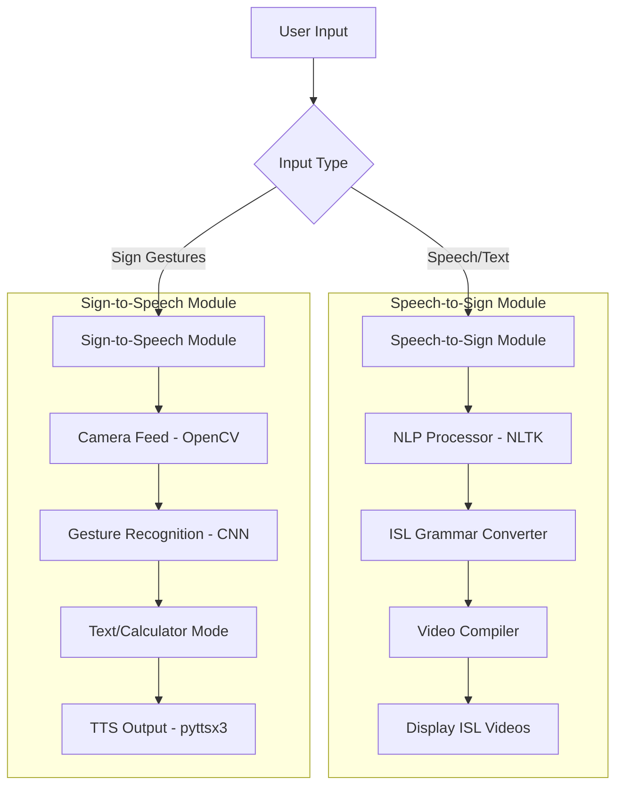
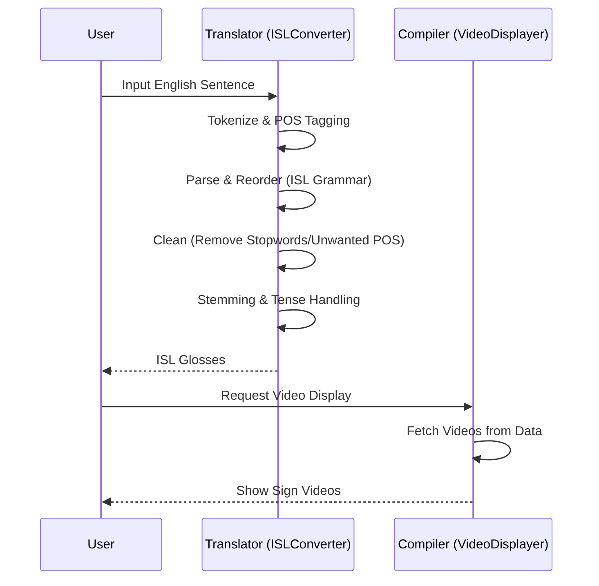

# Sign Language Translator

## Overview
The Sign Language Translator is a comprehensive platform designed to bridge the communication gap between the hearing-impaired community and the general public. By leveraging computer vision, deep learning, and natural language processing, the project enables two-way communication through Speech-to-Sign and Sign-to-Speech translation.

The project was developed with a focus on Social Impact, providing a tool that allows the deaf and dumb to communicate effortlessly without requiring the other party to be proficient in sign language.

## System Architecture
The system is divided into two primary modules, each handling one direction of communication.

## Key Features

### 1. Speech-to-Sign Translation
This module converts English speech or text into Indian Sign Language (ISL) glosses and displays them as a sequence of videos.

- **Natural Language Processing:** Uses `nltk` for tokenization, part-of-speech (POS) tagging, and parsing.
- **ISL Grammar Engine:** Implements specific rules for ISL, including:
    - Reordering Verb Phrases (VP) after Noun Phrases (NP).
    - Placing question words (what, when, where, etc.) at the end of the sentence.
    - Handling tenses by appending "before" for past and "after" for future.
    - Removing non-essential parts of speech (determiners, conjunctions, etc.).
- **Video Compilation:** Maps ISL glosses to pre-recorded video clips and plays them in sequence to form a signed sentence.

#### Translation Workflow

### 2. Sign-to-Speech Translation
This module uses a live camera feed to recognize sign language gestures and convert them into spoken text or mathematical operations.

- **Gesture Recognition:** Employs a Convolutional Neural Network (CNN) model trained on hand gestures.
- **Image Processing:** Uses OpenCV for real-time video processing, including background subtraction (back projection), Gaussian blurring, and contour detection to isolate hand gestures.
- **Dual Modes:**
    - **Text Mode:** Translates recognized gestures into words and constructs sentences, which are then spoken using the `pyttsx3` text-to-speech engine.
    - **Calculator Mode:** Allows users to perform arithmetic operations (addition, subtraction, multiplication, etc.) using sign gestures.
- **Feedback System:** Provides real-time visual feedback on a "blackboard" interface, displaying predicted text and current operation status.

## Technologies Used
- **Core:** Python 3.11
- **GUI:** PySide6 (Qt for Python)
- **Computer Vision:** OpenCV
- **Deep Learning:** Keras / TensorFlow
- **Natural Language Processing:** NLTK
- **Text-to-Speech:** pyttsx3
- **Database:** SQLite (for gesture mapping)
- **Dependency Management:** Poetry

## Project Structure
- `SignLanguage/main.py`: The main entry point for the application's graphical user interface.
- `SignLanguage/sign_to_text.py`: Core logic for sign recognition, speech output, and calculator functionality.
- `SignLanguage/SpeechToSign/`: Contains the NLP translator and the video display compiler for ISL.
- `SignLanguage/ui_main.py`: Generated UI code from the Qt Designer files.
- `pyproject.toml`: Configuration file defining project dependencies and metadata.

## License
This project is licensed under the GNU General Public License v3.0.
